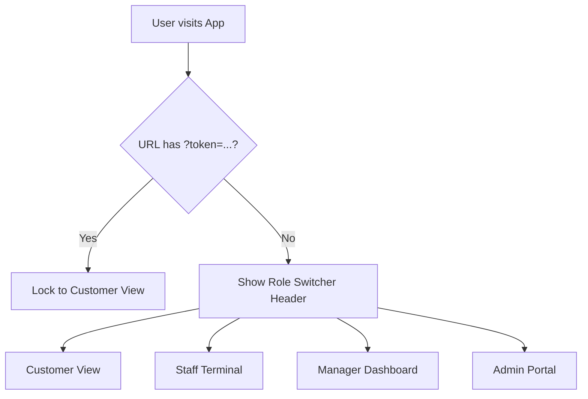

# Promotional Spin Hub: Product & Technical Documentation

This document provides a comprehensive overview of the **Promotional Spin Hub** (internally "Spin to Win"), covering its marketing positioning, core capabilities, technical architecture, and security design.

---

## Part 1: Marketing Assets & Copy Directive

### 1. Hero Headline + Sub-headline
* **Headline:** Turn customer visits into instantly redeemable rewards.
* **Sub-headline:** Launch custom promotional wheels with real-time audit logs.

### 2. Elevator Pitch
Drive physical and digital footfall using a secure, custom-branded promotional wheel that customers trust. Staff authorise spin sessions with single-use tokens, verify wins instantly on a dedicated terminal, and manage prize weightings on the fly.

### 3. Feature Bullets
* **Role-isolated interfaces** — Switch between dedicated customer spin pages, staff validation terminals, and manager configuration dashboards from a single deployment.
* **Tamper-proof vouchers** — Generate cryptographically distinct reward codes dynamically at the point of spin, preventing voucher duplication or early redemption.
* **Real-time prize weighting** — Adjust inventory thresholds and win probability distributions instantly via a secure manager dashboard without redeploying code.
* **Full audit trailing** — Log every spin, prize win, and staff voucher burn with timestamps and verified email records to eliminate internal slippage.
* **Zero telemetry, zero cookies** — Maintain GDPR and PECR compliance automatically with a system that collects no tracking data or persistent client-side cookies.

### 4. CTA Variants
* **Primary (Direct):** Request a developer demo
* **Secondary (Value-led):** Review the integration guide
* **Urgency-driven (Action-oriented):** Deploy your promotional wheel today

### 5. SEO Meta Title & Description
* **Meta Title:** Secure Promotional Spin Wheel Software | Its My App
* **Meta Description:** Deploy a secure, role-restricted promotional spin wheel app for live events and retail. Feature-rich manager dashboard, real-time audit logs, and zero cookies.

### 6. Email Subject Lines
* **A/B Test Variant A (Benefit-focused):** Secure, real-time retail promotions that increase footfall
* **A/B Test Variant B (Technical-credibility):** Self-hosted promotional wheel with Firestore security rules
* **A/B Test Variant C (Urgency/Direct):** Secure your next pop-up event with Promotional Spin Hub

### 7. Social Posts

#### LinkedIn Post
> Looking to drive customer engagement at your next live activation or in-store promotion without risking voucher fraud or data leakage?
> 
> The Promotional Spin Hub combines a high-fidelity customer-facing spin wheel with enterprise-grade security. 
> 
> * **Granular Roles:** Distinct views for Customers, Staff validation, Managers, and Admins.
> * **No Leakage:** Strict Firestore rules ensure only authorised staff can mark vouchers as burned.
> * **Zero Trackers:** GDPR compliance is built-in. No telemetry, no marketing cookies.
> 
> Read our full technical breakdown and secure deployment guide below.
> 
> [Link to Integration Guide] #RetailTech #SaaS #DeveloperTools #DataPrivacy

#### X (Twitter) Post
> Run promotional wheel events without the voucher fraud. Promotional Spin Hub is built on Next.js & Firebase, featuring granular role isolation and real-time audit logging. Zero tracking cookies, zero telemetry, absolute security. 🛠️
> 
> Check out the source code: [Link]

---

## Part 2: Product & Feature Breakdown

The application is structured as a unified promotional hub containing four distinct roles, all served from a single application route. The visible workspace layout adapts dynamically based on the user's role or the URL session parameters.



### 1. The Customer Spin Experience
* **Access Control:** When a user arrives with a token parameter in the URL (e.g. `?token=abc-123`), the header and role switcher are completely hidden. The application locks into **Customer Only Mode**, isolating the customer from staff or management views.
* **Interaction:** The customer is presented with an interactive, visually rich wheel. They can spin to win a prize from the current configured pool.
* **State Persistence:** Spins are tracked against the customer's unique Firestore record. Once a customer has used their spins, the interface transitions to display their winning voucher code and its redemption status.

### 2. The Staff Terminal
* **Purpose:** Designed for store staff, event workers, or cashiers at the physical point of service.
* **Capabilities:** 
  - Scan or input customer prize voucher codes manually.
  - Verify voucher validity (prizes won, validation status, and timestamps).
  - Burn vouchers to mark them as redeemed, permanently preventing duplicate claims.

### 3. The Manager Dashboard
* **Purpose:** For marketing managers and event coordinators to control campaign parameters.
* **Capabilities:**
  - View all customer spin logs and prize distributions.
  - Configure the prize pool (names, codes, quantities, and probability weightings).
  - Update custom promotional terms and conditions shown on the spin page.

### 4. The Admin Portal
* **Purpose:** Provides user management and access control.
* **Capabilities:**
  - Map authenticated user emails to specific roles (`staff`, `manager`, or `admin`).
  - Revoke or upgrade access privileges dynamically.

---

## Part 3: Technical Architecture

Promotional Spin Hub is built using a modern, serverless front-end stack that minimises maintenance overhead and scales automatically.

### Tech Stack Components
* **Framework:** Next.js (React & TypeScript) utilizing client-side state transition and dynamic URL parameter parsing.
* **Database & Auth:** Firebase Firestore and Firebase Authentication.
* **Styling:** Vanilla CSS with custom properties (`var(--color-gold)`, `var(--color-charcoal)`) providing a unified premium design system (dark mode, glassmorphism headers, and smooth micro-animations).

### Code Structure
* **Dynamic Views:** The main entry point [page.tsx](file:///c:/Users/mcozens/Documents/Websites_Apps/Apps/spin%20to%20win/src/app/page.tsx) handles URL query parsing to enforce Customer Only Mode. It imports client components for each interface:
  - [CustomerView](file:///c:/Users/mcozens/Documents/Websites_Apps/Apps/spin%20to%20win/src/app/components/CustomerView.tsx)
  - [StaffTerminal](file:///c:/Users/mcozens/Documents/Websites_Apps/Apps/spin%20to%20win/src/app/components/StaffTerminal.tsx)
  - [ManagerDashboard](file:///c:/Users/mcozens/Documents/Websites_Apps/Apps/spin%20to%20win/src/app/components/ManagerDashboard.tsx)
  - [AdminPortal](file:///c:/Users/mcozens/Documents/Websites_Apps/Apps/spin%20to%20win/src/app/components/AdminPortal.tsx)
* **Firestore Utilities:** [firestoreOps.ts](file:///c:/Users/mcozens/Documents/Websites_Apps/Apps/spin%20to%20win/src/lib/firestoreOps.ts) abstracts configuration fetching, customer registration, spin logging, and voucher burning.

---

## Part 4: Security Model & Verification Integrity

Security is built directly into the database architecture to prevent customers from tampering with win chances, altering configurations, or redeeming prizes multiple times.

### 1. Document-Level Firestore Rules
Database security is managed strictly via [firestore.rules](file:///c:/Users/mcozens/Documents/Websites_Apps/Apps/spin%20to%20win/firestore.rules). These rules guarantee that unauthenticated web clients cannot access sensitive administrative paths:

```javascript
rules_version = '2';
service cloud.firestore {
  match /databases/{database}/documents {

    // Spin Config: Read by authenticated clients, modified only by verified emails
    match /spinConfig/{doc} {
      allow read: if request.auth != null;
      allow write: if request.auth != null && request.auth.token.email != null;
    }

    // Customer Records: Read/write by authenticated clients (to allow spin execution)
    match /spinCustomers/{customerId} {
      allow read: if request.auth != null;
      allow write: if request.auth != null;
    }

    // Role Registry: Read by authenticated clients, modified only by verified emails
    match /spinRoles/{email} {
      allow read: if request.auth != null;
      allow write: if request.auth != null && request.auth.token.email != null;
    }
  }
}
```

### 2. Voucher Redemption Security
* **Single-Redemption Lifecycle:** Vouchers are burned via the `burnVoucher` function in [firestoreOps.ts](file:///c:/Users/mcozens/Documents/Websites_Apps/Apps/spin%20to%20win/src/lib/firestoreOps.ts).
* **Immutable Logs:** When a voucher code is redeemed, the document is updated to store the redeemer's verified email (`redeemedByEmail`) and the exact ISO timestamp (`redeemedAt`). Staff members cannot clear these values once set.
* **Anti-Spoofing Check:** Customer records must contain matching voucher codes (`prizeCode`) in their database profile. The staff terminal scans database documents directly to verify codes, ensuring that fake or guessed codes are immediately rejected.

### 3. Compliance and Privacy
* **Zero Cookies:** The application uses session parameters and local React state to coordinate the user experience. No tracking cookies are set, ensuring compliance with the PECR/GDPR cookie consent directives.
* **No Telemetry:** Customer data is held strictly within your own Google Cloud Firestore instance, preventing third-party leakages.
